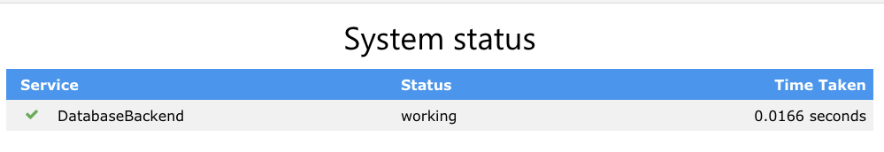

## 3. Setting up PostgreSQL

Previously, we have created and deployed a basic Django app using `docker-desktop` Kubernetes cluster. We can do the same using `minikube`. 

However, from here on, we will use `minikube` since there are features that we will need that `docker-desktop` does not provide.

However, to experience the true power of Django, it needs to be connected to a persistent datastore. We will use the Postgres database.

We are going to install a database within a Kubernetes cluster but a service offering such as [AWS RDS](https://aws.amazon.com/rds/). Such services provide features that can be hard to implement and manage well, which include:

• Managed high availability and redundancy.
• Ease of scaling up or down (i.e. vertical scaling) by increasing or decreasing the computational resource for the database instance to handle variable load.
• Ease of scaling in and out (i.e. horizontal scaling) by creating replicated instances to handle high read traffic.
• Automated snapshots and backups with the ability to easily roll back a database.
• Performing security patches, database monitoring etc.

However, there exists certain scenarios where a cloud native database solution is not feasible and thus Kubernetes is used to manage the database instances e.g. when running locally or on premise.

### Persistent Volumes
Pods and their counter parts, containers, are not meant to keep data after their life is over. They have _ephemeral_ storage.
Kubernetes, like Docker has the concept of volumes for persistent storage. The recommended type for databases is the `PersistentVolume` subsystem. 

Kubernetes provides two API resources which are the `PersistentVolume` and `PersistentVolumeClaim`.

**PersistentVolume**
A `PersistentVolume` (PV) resource is a piece of storage on the cluster analogous to a node. It has a different lifecycle to a pod and it captures the details of how storage is implemented.

The manifest file to create a PV is:
```
kind: PersistentVolume
apiVersion: v1
metadata:
  name: postgres-pv
  labels:
    type: local
spec:
  capacity:
    storage: 2Gi
  storageClassName: manual
  accessModes:
    - ReadWriteMany
  hostPath:
    path: /data/postgres-pv
```
A little explanation:
-   The  `spec: capacity: storage`  field states how much capacity to create.
-   The  `spec: accessModes`  defines how the pod will utilize the volume
-   The  `spec: hostPath`  field states that the volume is in the local file system on the storage node.

So we run the following to create the volume:
```
$ kubectl apply -f ./deploy/kubernetes/postgres/volume.yaml                                                                                                                                                                 
persistentvolume/postgres-pv created

$ kubectl get pv
NAME          CAPACITY   ACCESS MODES   RECLAIM POLICY   STATUS      CLAIM   STORAGECLASS   REASON   AGE
postgres-pv   2Gi        RWX            Retain           Available           manual                  16m
```
**PersistentVolumeClaim**
A  `PerstentVolumeClaim`  (PVC) is a request for storage by the user and allows the user to consume abstract storage resources on the cluster. Claims can request specific sizes and access modes in the cluster. In this way the volume definition (PV) and volume consumption (PVC) remains separate. The manifest to create a PVC is:
```
kind: PersistentVolumeClaim
apiVersion: v1
metadata:
  name: postgres-pvc
  labels:
    type: local
spec:
  storageClassName: manual
  accessModes:
    - ReadWriteMany
  resources:
    requests:
      storage: 2Gi
  volumeName: postgres-pv
```
Let create the volume claim:
```
$ kubectl apply -f ./deploy/kubernetes/postgres/volume_claim.yaml                                                                                                                                                            
persistentvolumeclaim/postgres-pvc created

$ kubectl get pvc
NAME           STATUS   VOLUME        CAPACITY   ACCESS MODES   STORAGECLASS   AGE
postgres-pvc   Bound    postgres-pv   2Gi        RWX            manual         56s                                      
```
We now have a volume and a way to claim what we want in the volume.

### Postgres Credentials
We need to create and access the Postgres database, and the credentials are required from our Django application. We cannot put them in a place that they would be exposed to the "outside" world. 

Kubernetes provides the **_Secret object_** to store sensitive data. A Secret object can be created using the declarative file specification or from the command line.

Let's look at the declarative file specification for the Secret object:
```
apiVersion: v1
kind: Secret
metadata:
  name: postgres-credentials
type: Opaque
data:
  user: a3ViZV9ib3Nz
  password: MWEyNmQxZzI2ZDFnZXNiP2U3ZGVzYj9lN2Q=
```
Notice the `data: user` field as well as the `data: password` field. These contains `base64` encoded strings where the encoding can be generated from the command line. The `user` can be generated by running:
```
echo -n "kube_boss" | base64
```
`base64` is an encode format. This is NOT encrypted, so care should be taken when managing the `secrets.yaml` file. The Secret object is then added to the kubernetes cluster using:
```
$ kubectl apply -f ./deploy/kubernetes/postgres/secrets.yaml                                                                                                                                                                 
secret/postgres-credentials created
```
### Postgres Deployment
The Postgres manifest for deployment is similar to the Django manifest. We will use the `postges:13` container image which will be fetched from the `hub.docker.com` registry.

The data is physically stored in the `PersistentVolume`. The mounting point is named in the deployment manifest.  together with the `PersistentVolumeClaim` which are used to access the volume. 

The database credentials will be stored in the **_Secret object_** and this will be mounted into the pod in is the default location `var/lib/postgresql/data` where the database is also stored. So the database is accessed using the credentials in the **_Secret object_** and then the database, using the `PersistentVolumeClaim`, access the `PersistentVolume` that has the data. 

Our deployment manifest looks like so:
```
apiVersion: apps/v1
kind: Deployment
metadata:
  name: postgres
spec:
  replicas: 1
  selector:
    matchLabels:
      app: postgres-container
  template:
    metadata:
      labels:
        app: postgres-container
        tier: backend
    spec:
      containers:
        - name: postgres-container
          image: postgres:13
          env:
            - name: POSTGRES_USER
              valueFrom:
                secretKeyRef:
                  name: postgres-credentials
                  key: user

            - name: POSTGRES_PASSWORD
              valueFrom:
                secretKeyRef:
                  name: postgres-credentials
                  key: password

            - name: POSTGRES_DB
              value: kubernetes_django

          ports:
            - containerPort: 5432
          volumeMounts:
            - name: postgres-volume-mount
              mountPath: /var/lib/postgresql/data

      volumes:
        - name: postgres-volume-mount
          persistentVolumeClaim:
            claimName: postgres-pvc
```
We create the deployment:
```
$ kubectl apply -f ./deploy/kubernetes/postgres/deployment.yaml                                                                                                                                                              
deployment.apps/postgres created
```
### Connecting to Django
To connect to Django, the following modifications needs to be made to the `DATABASES` variable in the `settings.py` file.
```
DATABASES = {  
    'default': {  
        'ENGINE': 'django.db.backends.postgresql',  
        'NAME': 'kubernetes_django',  
        'USER': os.getenv('POSTGRES_USER'),  
        'PASSWORD': os.getenv('POSTGRES_PASSWORD'),  
        'HOST': os.getenv('POSTGRES_HOST'),  
        'PORT': os.getenv('POSTGRES_PORT', 5432) }  
}
```
The database credentials will be inferred from the environment variables. These environment variables are referenced  in the Postgres deployment manifest as `env`  variables.
Now that we have made changes, we will create a new image with these changes.  We update the tag `v2` so that the deployment can be updated in the cluster.
```
docker build -t theredafro/django_k8s:v2 .                                                                                                                                                                                 
...
Successfully tagged theredafro/django_k8s:v2
```
We update the Django deployment manifest:
```
apiVersion: apps/v1
kind: Deployment
metadata:
  name: kubernetes-django
  labels:
    app: django
spec:
  replicas: 1
  selector:
    matchLabels:
      app: django-container
  template:
    metadata:
      labels: 
        app: django-container
    spec:
      containers:
        - name: django-web
          image: theredafro/django_k8s:v2
          command: ['/bin/bash', 'run.sh'] # runs migrations and starts the server
          ports:
            - containerPort: 8000
          env:
            - name: POSTGRES_USER
              valueFrom:
                secretKeyRef:
                  name: postgres-credentials
                  key: user

            - name: POSTGRES_PASSWORD
              valueFrom:
                secretKeyRef:
                  name: postgres-credentials
                  key: password

            - name: POSTGRES_HOST
              value: postgres-service
```
Once the database is up and running, we will need to implement the database schema on it. This is the `run.sh` mentioned in the manifest.
```
python manage.py migrate
gunicorn kubernetes_django.wsgi:application --bind 0.0.0.0:8000 --log-level info --timeout 180  --workers 3
```

There are a number of things that we are doing that are crucial:
-   Updating the project image to the new version - `v2`.
-   Setting the database credentials as environmental variables which will be passed into the Django `settings` file. The  `POSTGRES_USER`  and  `POSTGRES_PASSWORD`  variables are extracted from the Secret object that was created earlier. The  `POSTGRES_HOST`  variable takes on the value of the Postgres service that we created. As was explained, Kubernetes is clever enough to map the postgres service name to the actual pod IP.
-   Add a bash script i.e.  `run.sh`  which contains the following commands to run the migrations (more on migrations later on) as well as to start a gunicorn server.

We deploy the updated Django manifest to the cluster.
```
kubectl apply -f ./deploy/kubernetes/django/deployment.yaml                                                                                                                                                                
deployment.apps/kubernetes-django created
```
We create the service:
```
$ kubectl apply -f ./deploy/kubernetes/django/service.yaml                                                                                                                                                                   
service/django-service created

$ kubectl get svc                                                                                                                                                                                                            
                                                                                                                                                                                                                                                                                                       
NAME             TYPE        CLUSTER-IP    EXTERNAL-IP   PORT(S)          AGE
django-service   NodePort    10.107.64.5   <none>        8000:31971/TCP   18s
kubernetes       ClusterIP   10.96.0.1     <none>        443/TCP          143m
```
With the service name, `django-service`, we use minikube:
```
$ minikube service django-service
                                                                                                                                          
|-----------|----------------|-------------|---------------------------|
| NAMESPACE |      NAME      | TARGET PORT |            URL            |
|-----------|----------------|-------------|---------------------------|
| default   | django-service |        8000 | http://192.168.49.2:31299 |
|-----------|----------------|-------------|---------------------------|
🏃  Starting tunnel for service django-service.
|-----------|----------------|-------------|------------------------|
| NAMESPACE |      NAME      | TARGET PORT |          URL           |
|-----------|----------------|-------------|------------------------|
| default   | django-service |             | http://127.0.0.1:51782 |
|-----------|----------------|-------------|------------------------|
🎉  Opening service default/django-service in default browser...
❗  Because you are using a Docker driver on darwin, the terminal needs to be open to run it.
```
This is what we get on the browser:


### Database Migrations
The database migration was a success because we run the `run.sh` script. There are a few ways to run database migrations, and we will focus on three ways, which are;

-   Using a bash script as seen earlier (what we used).
-   Using the Job API.
-   Directly as a shell command via a pod.

All of them have their advantages and disadvantages which we will briefly touch on.

**Using a bash script**
This is the simplest way that I have found to run migrations. In my experience simply adding a bash script and initiating it as a container command (as seen earlier) prevents a lot of headaches and complexity and it is quite easy to automate. The `run.sh` has 2 simple commands, but can be more complex depending on the use case.
```
python manage.py migrate
gunicorn kubernetes_django.wsgi:application --bind 0.0.0.0:8000 --log-level info --timeout 180 --workers 3
```

**Job Resource**
A Job creates a pod which runs a single task to completion. This task can be anything, but in our case, it is the Django migration. The job configuration file is:
```
apiVersion: batch/v1
kind: Job
metadata:
  name: django-migrations
spec:
  template:
    spec:
      containers:
        - name: django-web
          image: theredafro/django_k8s:v2
          command: ['python', 'manage.py', 'migrate']
          env:
            - name: POSTGRES_USER
              valueFrom:
                secretKeyRef:
                  name: postgres-credentials
                  key: user

            - name: POSTGRES_PASSWORD
              valueFrom:
                secretKeyRef:
                  name: postgres-credentials
                  key: password

            - name: POSTGRES_HOST
              value: postgres-service
      restartPolicy: Never
  backoffLimit: 5
```
The Job is scheduled on the cluster using:
```
$ kubectl apply -f ./deploy/kubernetes/django/job-migration.yaml
job.batch/django-migrations created

$ kubectl get pods
NAME                                 READY   STATUS             RESTARTS   AGE
django                               0/1     ImagePullBackOff   0          22h
django-6c9fdbdddb-jpxhv              0/1     ImagePullBackOff   0          22h
django-migrations-kxtrq              0/1     Completed          0          36s
kubernetes-django                    0/1     ImagePullBackOff   0          22h
kubernetes-django-8669c58bfb-h7dwf   1/1     Running            0          100m
postgres-59bb9cd9c4-src2j            1/1     Running            0          103m
```
To see the actual details of the migration, we would go to the logs:
```
$ kubectl logs django-migrations-kxtrq
Operations to perform:
  Apply all migrations: admin, auth, contenttypes, db, sessions
Running migrations:
  No migrations to apply.
```
We had no migrations left pending since we had already executed them using the `run.sh`.

**With the CLI**
Migrations can also be executed from the shell of a running container using the  `kubectl exec`  command. In order to run the migrations, we have the name of the running pod of interest, so we execute the command:
```
$ kubectl exec kubernetes-django-8669c58bfb-h7dwf -- python /app/manage.py migrate
Operations to perform:
  Apply all migrations: admin, auth, contenttypes, db, sessions
Running migrations:
  No migrations to apply.
```
### Troubleshooting
This container business always has problems. In some cases, you might have to delete all the deployments and services,  restart minikube and redeploy. That is what I did starting with the `volume` all the way to the last `service` call.